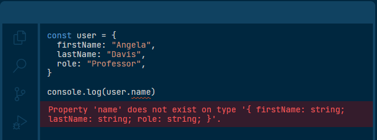

# TypeScript Demo

This is a simple demo to show how TypeScript works.

## What is TypeScript?

- TS is an open-source language that builds on JavaScript, by adding static type definitions
- Types provide a way to describe the shape of objects
- TS validates your code is working correctly BEFORE you run it
- All valid JS code is also valid TS code (you might get type-checking errors, but you can still run it)
- Supports gradual adoption

### Helpful Links

- [TypeScript for Java/C# Programmers](https://www.typescriptlang.org/docs/handbook/typescript-in-5-minutes-oop.html)
- [The TypeScript Handbook](https://www.typescriptlang.org/docs/handbook/intro.html)

### Table of Contents

1. [Types by Inference](./1-types-by-inference.ts)
2. [Define your own types](./2-defining-own-types.ts)
3. [Return types](./3-return-types.ts)
4. [Any/Unknown](./4-any-unknown.ts)
5. [Autocomplete](./5-autocomplete.ts)
6. [Enums](./6-enums.ts)
7. [Error/warning helpers](./7-errors-warnings.ts)
8. [Type definition files](./8-type-definition-files.d.ts)
